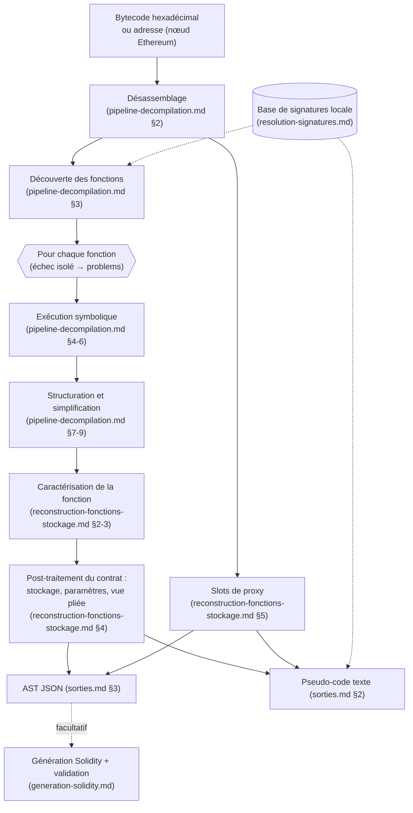

# Architecture et interfaces d'appel de Scobelix

Scobelix est un décompilateur EVM générique, dérivé du décompilateur Panoramix : à partir du bytecode runtime d'un contrat (fourni directement ou récupéré à partir de son adresse), il produit un pseudo-code lisible, un AST JSON structuré (fonctions, traces, structure du stockage, slots de proxy reconnus) et, sur demande, une reconstruction Solidity « best-effort » éventuellement validée par un compilateur externe. Ce document (préfixe `ARCH`) énonce les exigences qui portent sur la nature du système, ses capacités, l'enchaînement global de son pipeline, sa configuration, ses dépendances, sa politique de robustesse, ainsi que le contrat exact de ses deux façades d'invocation : la commande `scobelix` et l'interface de programmation Python.

Le détail de chaque étape du pipeline est spécifié ailleurs : désassemblage, découverte des fonctions, exécution symbolique, structuration et simplification dans [pipeline-decompilation.md](pipeline-decompilation.md) ; caractérisation des fonctions, inférence des paramètres, structure du stockage et slots de proxy dans [reconstruction-fonctions-stockage.md](reconstruction-fonctions-stockage.md) ; nommage des fonctions par leurs sélecteurs dans [resolution-signatures.md](resolution-signatures.md) ; reconstruction Solidity et validation dans [generation-solidity.md](generation-solidity.md). Le format exact de tout ce qui est produit est dans [sorties.md](sorties.md), les échanges avec l'extérieur (nœud Ethereum, compilateur, système de fichiers, distribution, intégration continue) dans [integration.md](integration.md), et le format des bases de signatures dans [../specification-parametrage/parametrage-signatures.md](../specification-parametrage/parametrage-signatures.md). Voir [README.md](../README.md) pour la table des matières du répertoire `docs/`.

Chaque exigence est identifiée par un code FR-ARCH-NN. Sauf mention contraire (« DEVRAIT », « PEUT », « NE DOIT PAS »), une exigence est obligatoire (« DOIT »).

## 1. Vue d'ensemble et nature du système

Scobelix n'est pas un service : c'est un outil de ligne de commande et une bibliothèque importable qui s'exécutent dans le processus de l'utilisateur, du début à la fin d'une décompilation.

- **FR-ARCH-01** : Le système DOIT être utilisable à la fois comme bibliothèque Python importable par un programme tiers et comme commande en ligne, sans exposer de serveur HTTP, de socket d'écoute, de file de messages ni de base de données externe.
- **FR-ARCH-02** : Le système DOIT exécuter une décompilation de manière synchrone, dans un unique processus et sur le fil d'exécution de l'appelant, et ne rendre la main qu'une fois toutes les sorties demandées produites.
- **FR-ARCH-03** : Le système NE DOIT effectuer aucun accès réseau, à la seule exception de la récupération du code d'un contrat lorsque l'entrée est une adresse (voir [integration.md](integration.md), section 1) ; en particulier, la résolution des noms de fonctions NE DOIT consulter aucun service en ligne (voir [resolution-signatures.md](resolution-signatures.md)).
- **FR-ARCH-04** : Le système DOIT traiter toute séquence d'octets fournie comme du bytecode runtime EVM ; il NE DOIT accepter ni code source ni ABI en entrée, et il ne distingue pas un bytecode de création (constructeur suivi du code déployé), qui serait décompilé tel quel comme s'il s'agissait du code déployé.
- **FR-ARCH-05** : Le système DOIT conserver le style de pseudo-code de l'outil dont il est dérivé ; en conséquence, la sortie texte commence par l'en-tête hérité `# Palkeoramix decompiler. ` et non par le nom du système (format exact dans [sorties.md](sorties.md), section 2).
- **FR-ARCH-06** : Une décompilation DOIT produire, en une seule passe, un résultat composé de quatre parties : le pseudo-code texte, le désassemblage, l'AST JSON et la liste des indices de slots de proxy reconnus.

## 2. Capacités (points d'entrée fonctionnels)

- **FR-ARCH-07** : Le système DOIT fournir une capacité de décompilation à partir d'un bytecode exprimé en hexadécimal, avec ou sans préfixe `0x`, qui produit le résultat en quatre parties décrit en FR-ARCH-06.
- **FR-ARCH-08** : Le système DOIT fournir une capacité de décompilation à partir d'une adresse de contrat, qui récupère le code déployé auprès d'un nœud Ethereum (voir [integration.md](integration.md), section 1) puis produit exactement le même résultat que la décompilation du bytecode obtenu.
- **FR-ARCH-09** : Ces deux capacités DOIVENT accepter un filtre optionnel par préfixe de nom de fonction : seules les fonctions découvertes dont le nom affiché commence par ce préfixe sont décompilées ; les autres sont ignorées silencieusement, sans figurer dans la liste des échecs.

*Note contextuelle : dans l'état actuel du système, la découverte des fonctions ne produit jamais qu'une seule fonction de repli, nommée `_fallback(?)`, qui contient l'arbre de dispatch de tout le contrat (voir [pipeline-decompilation.md](pipeline-decompilation.md), section 3). Le filtre hérité de l'outil amont est donc presque toujours inopérant (préfixe de `_fallback(?)`) ou vide entièrement la sortie (tout autre préfixe).*

- **FR-ARCH-10** : Le système DOIT fournir une capacité de génération Solidity qui prend en entrée un résultat de décompilation, n'en lit que l'AST JSON, et produit un code source, un niveau de confiance par fonction et une liste d'avertissements (voir [generation-solidity.md](generation-solidity.md)).
- **FR-ARCH-11** : Le système DOIT fournir une capacité de validation d'un code Solidity généré par un compilateur externe, dont le résultat est l'un des statuts `valid`, `invalid` ou `skipped` (voir [generation-solidity.md](generation-solidity.md), section 5).
- **FR-ARCH-12** : Le système DOIT fournir, en dehors du pipeline de décompilation, un outil satellite de régénération de la base de signatures locale à partir de fichiers ABI (voir [resolution-signatures.md](resolution-signatures.md), section 5).
- **FR-ARCH-13** : Lorsque le bytecode fourni est vide, le système DOIT produire, sans lever d'erreur, le résultat « aucun code » : un texte réduit à un message unique, sans l'en-tête de FR-ARCH-05 (format dans [sorties.md](sorties.md), section 2.1), un AST vide `{}`, un désassemblage vide et une liste d'indices de proxy vide.

## 3. Pipeline de décompilation (vue d'ensemble)

Chaque étape est spécifiée dans le document indiqué sur le diagramme ; cette section ne fixe que leur enchaînement et leurs interactions.

- **FR-ARCH-14** : Le système DOIT enchaîner, dans cet ordre : le désassemblage du bytecode ; une passe légère d'exécution symbolique de découverte des fonctions ; pour chaque fonction retenue, l'exécution symbolique complète, la structuration des boucles et la simplification, puis la caractérisation de la fonction ; ensuite, au niveau du contrat entier, la reconstruction de la structure du stockage, le remplacement des accès aux paramètres par leurs noms, la préparation de la vue d'affichage ; enfin la détection des slots de proxy, la sérialisation de l'AST JSON et le rendu du texte.
- **FR-ARCH-15** : Le système DOIT décompiler chaque fonction indépendamment des autres : une exception ou un dépassement du budget par fonction (voir section 4) DOIT ajouter la fonction à la liste des échecs (`problems`), être journalisé (voir [sorties.md](sorties.md), section 6), et NE DOIT PAS interrompre la décompilation des autres fonctions ni le post-traitement du contrat.
- **FR-ARCH-16** : Le système DOIT effectuer la reconstruction de la structure du stockage une seule fois pour l'ensemble des fonctions décompilées, après leur décompilation, et non fonction par fonction (voir [reconstruction-fonctions-stockage.md](reconstruction-fonctions-stockage.md), section 4).
- **FR-ARCH-17** : Le système DOIT détecter les slots de proxy à partir du seul désassemblage brut, indépendamment des traces symboliques et du résultat de leur décompilation (voir [reconstruction-fonctions-stockage.md](reconstruction-fonctions-stockage.md), section 5).
- **FR-ARCH-18** : Le système DOIT produire l'AST JSON et le texte dans la même passe, à partir des mêmes fonctions post-traitées ; la répartition entre trace non pliée (AST) et vue pliée (texte) est spécifiée dans [pipeline-decompilation.md](pipeline-decompilation.md), section 10.

## 4. Configuration

La configuration se fait exclusivement par variables d'environnement ; aucun fichier de configuration n'est lu.

| Variable | Défaut | Rôle |
|---|---|---|
| `PANORAMIX_FUNCTION_TIMEOUT` | 720 | budget total, en secondes, de la décompilation d'une fonction |
| `PANORAMIX_VM_RUN_TIMEOUT` | 600 | budget, en secondes, de l'exécution symbolique d'une fonction |
| `PANORAMIX_WHILES_TIMEOUT` | 600 | budget, en secondes, de la simplification d'une fonction |
| `PANORAMIX_LOADER_TIMEOUT` | 120 | budget, en secondes, de la passe de découverte des fonctions |
| `PANORAMIX_MAX_NODE_COUNT` | 500000 | nombre maximal de nœuds d'exploration par exécution symbolique |
| `WEB3_PROVIDER_URI` | (aucun) | point d'accès du nœud Ethereum, lu par la bibliothèque d'accès Ethereum |
| `SCOBELIX_ABI_ROOTS` | (vide) | répertoires parcourus par l'outil de régénération des signatures |
| `SCOBELIX_SIGS_OUT` | fichier de signatures embarqué | fichier écrit par l'outil de régénération des signatures |

- **FR-ARCH-19** : Le système DOIT lire les variables de budget et de nombre de nœuds une seule fois, au chargement du système dans le processus ; une modification ultérieure de l'environnement du processus NE DOIT PAS avoir d'effet sur les décompilations suivantes.
- **FR-ARCH-20** : Le système DOIT borner la décompilation complète d'une fonction (exécution symbolique, structuration et simplification) par le budget `PANORAMIX_FUNCTION_TIMEOUT`, par défaut 720 secondes ; son dépassement interrompt la fonction et la range parmi les échecs (FR-ARCH-15).
- **FR-ARCH-21** : Le système DOIT borner l'exécution symbolique d'une fonction par le budget `PANORAMIX_VM_RUN_TIMEOUT`, par défaut 600 secondes ; l'effet d'un dépassement est spécifié dans [pipeline-decompilation.md](pipeline-decompilation.md), section 4.
- **FR-ARCH-22** : Le système DOIT borner la boucle de simplification d'une fonction par le budget `PANORAMIX_WHILES_TIMEOUT`, par défaut 600 secondes ; l'effet d'un dépassement est spécifié dans [pipeline-decompilation.md](pipeline-decompilation.md), section 8.
- **FR-ARCH-23** : Le système DOIT borner la passe de découverte des fonctions par le budget `PANORAMIX_LOADER_TIMEOUT`, par défaut 120 secondes.
- **FR-ARCH-24** : Une valeur nulle de l'un de ces quatre budgets DOIT désactiver la limite de temps correspondante.
- **FR-ARCH-25** : Le système DOIT limiter chaque exécution symbolique à `PANORAMIX_MAX_NODE_COUNT` nœuds d'exploration, par défaut 500 000 ; cette valeur fixe aussi le seuil de l'élagage décrit dans [pipeline-decompilation.md](pipeline-decompilation.md), section 4. Contrairement aux budgets de temps, une valeur nulle NE DOIT PAS être interprétée comme « sans limite » : elle arrête l'exploration dès la fin de sa première itération et active l'élagage en permanence.
- **FR-ARCH-26** : Une valeur non entière de l'une des cinq variables `PANORAMIX_*` DOIT provoquer une erreur dès le chargement des capacités de décompilation (donc au démarrage de la commande), avant toute décompilation ; les capacités de génération et de validation Solidity, chargées seules par un programme Python, n'y sont pas sensibles.
- **FR-ARCH-27** : Le système NE DOIT PAS interpréter lui-même `WEB3_PROVIDER_URI` : cette variable est laissée à la bibliothèque d'accès Ethereum, qui l'utilise pour choisir le nœud interrogé en mode adresse (voir [integration.md](integration.md), section 1).
- **FR-ARCH-28** : Les variables `SCOBELIX_ABI_ROOTS` et `SCOBELIX_SIGS_OUT` DOIVENT n'être lues que par l'outil de régénération des signatures et n'avoir aucun effet sur une décompilation (voir [resolution-signatures.md](resolution-signatures.md), section 5).
- **FR-ARCH-29** : Les paramètres suivants DOIVENT être des constantes non configurables du système :

  | Paramètre | Valeur | Spécifié dans |
  |---|---|---|
  | Seuil de « grande trace » (lignes de premier niveau) | 2 000 | [pipeline-decompilation.md](pipeline-decompilation.md), section 8 |
  | Nombre maximal de passes de simplification | 40 (20 au-delà du seuil) | [pipeline-decompilation.md](pipeline-decompilation.md), section 8 |
  | Nettoyage mémoire sauté au-delà de | 2 000 lignes | [pipeline-decompilation.md](pipeline-decompilation.md), section 8 |
  | Itérations d'exploration | 20 × 200 | [pipeline-decompilation.md](pipeline-decompilation.md), section 4 |
  | Seuil d'élagage | 60 % du nombre maximal de nœuds | [pipeline-decompilation.md](pipeline-decompilation.md), section 4 |
  | Délai maximal de validation par le compilateur | 30 secondes | [generation-solidity.md](generation-solidity.md), section 5 |
  | Pragma du Solidity généré | `^0.8.0` | [generation-solidity.md](generation-solidity.md), section 2 |
  | Emplacement du cache de signatures | répertoire de cache utilisateur de l'application `scobelix` | [integration.md](integration.md), section 3 |

*Note contextuelle : deux préfixes de variables d'environnement coexistent. Les budgets et le nombre de nœuds gardent le préfixe `PANORAMIX_` hérité de l'outil amont, tandis que les variables propres à l'outil de régénération portent le préfixe `SCOBELIX_`. Les noms sont conservés tels quels pour la compatibilité.*

## 5. Dépendances fonctionnelles

- **FR-ARCH-30** : Le système DOIT fonctionner avec un interpréteur Python de version supérieure ou égale à 3.9 et strictement inférieure à 4.
- **FR-ARCH-31** : Le système DOIT mettre en œuvre le budget par fonction au moyen d'un signal d'horloge du système d'exploitation ; il exige donc une plateforme disposant de ce mécanisme (les plateformes Windows ne sont pas supportées) et un appel depuis le fil d'exécution principal du processus (voir FR-ARCH-66).
- **FR-ARCH-32** : Le système DOIT s'appuyer sur une bibliothèque d'accès Ethereum figée à la version bêta 6.0.0-beta.8 pour la récupération du code d'une adresse, le calcul des hachés keccak-256 et la mise au format checksum des adresses ; cette bibliothèque est sollicitée par le mode adresse, par le générateur Solidity dès son chargement (table d'événements connus) et par l'outil de régénération des signatures, mais pas par la décompilation d'un bytecode.
- **FR-ARCH-33** : Le système DOIT s'appuyer sur une bibliothèque de journalisation colorée pour la commande en ligne, et sur une bibliothèque de localisation du répertoire de cache utilisateur standard de la plateforme pour le cache de signatures.
- **FR-ARCH-34** : Le système NE DOIT PAS déclarer le compilateur Solidity comme dépendance : ce binaire externe est facultatif et n'est sollicité que par la validation, qui tolère son absence (voir [generation-solidity.md](generation-solidity.md), section 5, et, pour ce qui est attendu du compilateur, [integration.md](integration.md), section 2).
- **FR-ARCH-35** : Le système DOIT embarquer, dans son paquet distribué, deux fichiers de données de signatures : un dump compressé d'environ 22,8 Mio (1 534 891 entrées à ce jour) et un fichier de signatures locales (557 entrées à ce jour), dont les formats sont spécifiés dans [../specification-parametrage/parametrage-signatures.md](../specification-parametrage/parametrage-signatures.md).

*Note contextuelle : une bibliothèque cliente HTTP figure parmi les dépendances déclarées du paquet mais n'est utilisée nulle part ; sa présence ne traduit aucun accès réseau supplémentaire. Le budget par fonction repose, lui, sur une petite bibliothèque dédiée utilisée en mode « signaux ».*

## 6. État partagé, caches et robustesse

- **FR-ARCH-36** : Le système DOIT conserver en mémoire, pour toute la durée du processus et sans jamais les purger, ses caches de simplification d'expressions, d'opérations algébriques, de masques, de signatures résolues et de noms de fonctions formatés.
- **FR-ARCH-37** : Des décompilations successives dans un même processus (liste d'entrées de la commande, usage répété de la bibliothèque) DOIVENT être considérées comme partageant cet état : outre les caches, l'ensemble des emplacements de stockage déjà nommés lors des décompilations précédentes est conservé et peut influer sur le nommage des suivantes ; un appelant qui exige des résultats strictement indépendants DOIT lancer un processus par décompilation.
- **FR-ARCH-38** : Le système DOIT remettre à zéro le compteur de nœuds d'exploration au début de chaque exécution symbolique (passe de découverte et chaque fonction), de sorte que le budget de nœuds s'applique à chacune séparément.

À la différence de ces caches en mémoire, le cache disque de signatures persiste d'un processus à l'autre ; sa construction et son cycle de vie sont spécifiés dans [resolution-signatures.md](resolution-signatures.md), section 3, et son emplacement dans [integration.md](integration.md), section 3.

- **FR-ARCH-39** : Lorsqu'une étape auxiliaire échoue, le système DOIT journaliser l'exception et se replier localement plutôt qu'échouer globalement ; les replis sont spécifiés avec chaque étape : découverte des fonctions ([pipeline-decompilation.md](pipeline-decompilation.md), section 3), pliage ([pipeline-decompilation.md](pipeline-decompilation.md), section 10) et reconstruction du stockage ([reconstruction-fonctions-stockage.md](reconstruction-fonctions-stockage.md), section 4.4).
- **FR-ARCH-40** : Si l'AST JSON n'est pas sérialisable, le système DOIT le remplacer par un objet vide `{}`, journaliser `Failed json serialization.` au niveau erreur et poursuivre la production du texte, sans retourner d'erreur à l'appelant.
- **FR-ARCH-41** : Le système DOIT propager à l'appelant, sans reprise, les erreurs qui empêchent de commencer la décompilation (hexadécimal invalide, adresse non alphanumérique, erreur du nœud Ethereum) ainsi que les erreurs survenant, après la décompilation des fonctions, dans les étapes qui ne disposent d'aucun repli : préparation de la vue d'affichage (hors pliage) et rendu du texte.
- **FR-ARCH-42** : Le dépassement du budget par fonction DOIT interrompre la fonction même lorsque l'étape en cours absorbe les erreurs ordinaires (repli local sur exception), afin qu'aucune étape interne ne puisse neutraliser ce budget.

*Note contextuelle : plusieurs composants hérités exécutent de petites auto-vérifications (assertions) au moment de leur chargement ; elles ralentissent légèrement le démarrage et disparaissent lorsque l'interpréteur est lancé en mode optimisé. Elles ne font pas partie du contrat fonctionnel ; une partie a été convertie en tests de la suite de non-régression (voir [integration.md](integration.md), section 6).*

## 7. Interface en ligne de commande

- **FR-ARCH-43** : Le système DOIT être installé avec une commande unique, `scobelix`, déclarée comme script console du paquet, et DOIT être également invocable au moyen de l'interpréteur Python en mode module, sous le même nom, avec un comportement identique (seul le nom de programme repris dans les messages d'usage et d'erreur de l'analyseur d'arguments diffère).
- **FR-ARCH-44** : La commande DOIT exiger exactement un argument positionnel (adresse, bytecode, liste ou `-`) ; son absence DOIT provoquer une erreur de l'analyseur d'arguments, un message d'usage sur la sortie d'erreur et un code de sortie 2.
- **FR-ARCH-45** : La commande DOIT déterminer la nature de l'argument positionnel uniquement d'après sa longueur : une chaîne d'exactement 42 caractères est traitée comme une adresse de contrat ; toute autre longueur est traitée comme un bytecode hexadécimal.

*Note contextuelle : cette règle ne vérifie pas le contenu ; un bytecode de 21 octets écrit sans préfixe (42 chiffres hexadécimaux) serait pris pour une adresse et déclencherait un accès au nœud, tandis qu'une adresse écrite sans son préfixe `0x` (40 caractères) serait décompilée comme un bytecode.*

- **FR-ARCH-46** : La valeur `-` DOIT faire lire l'intégralité de l'entrée standard, dont les espaces et retours à la ligne de début et de fin sont retirés ; le contenu obtenu est ensuite soumis à la même règle de longueur que FR-ARCH-45.
- **FR-ARCH-47** : Un argument positionnel contenant au moins une virgule DOIT être découpé sur les virgules et chaque élément traité successivement, dans l'ordre, dans le même processus et avec les mêmes options, les sorties étant écrites les unes à la suite des autres ; les éléments ne sont pas débarrassés de leurs espaces. Une erreur sur un élément DOIT interrompre le traitement des éléments suivants, les sorties déjà écrites restant acquises (code de sortie de FR-ARCH-57).
- **FR-ARCH-48** : L'option `-v` DOIT fixer le niveau de journalisation avant tout traitement, par défaut le niveau INFO (valeur numérique 20). Une valeur composée uniquement de caractères numériques DOIT être convertie en entier et retenue comme niveau. Une autre valeur DOIT être acceptée si, mise en majuscules, elle correspond à un nom défini en majuscules par la bibliothèque de journalisation standard de Python : cela couvre les noms de niveau, insensibles à la casse (`DEBUG`, `INFO`, `WARNING`, `ERROR`, `CRITICAL`, ainsi que les alias `WARN`, `FATAL` et `NOTSET`), mais aussi le nom `BASIC_FORMAT`, qui n'est pas un niveau et que la commande accepte sans erreur. Une valeur qui ne remplit aucune de ces deux conditions (y compris un nombre négatif) DOIT provoquer l'erreur `Logging should be DEBUG/INFO/WARNING/ERROR.` et un code de sortie 1.

*Note contextuelle : ce contrôle se fonde sur les noms définis par la bibliothèque de journalisation, et non sur une liste de niveaux, d'où deux résidus. Avec `BASIC_FORMAT`, la décompilation s'exécute au niveau INFO, niveau par défaut de la bibliothèque de journalisation colorée, et se termine avec le code 0. Le nom `_STYLES` passe lui aussi le contrôle, mais il est ensuite refusé par une erreur de type de niveau (code 1). De même, le contrôle « uniquement numérique » admet tout caractère numérique Unicode. Les chiffres décimaux d'autres écritures (par exemple `٣`) sont convertis normalement. Les exposants, fractions et numéraux non décimaux (par exemple `²`) échouent à la conversion en entier, avec le message d'erreur de conversion de l'interpréteur au lieu du message ci-dessus, toujours avec le code 1.*

- **FR-ARCH-49** : L'option `--profile` DOIT enregistrer les statistiques de profilage de l'exécution dans le fichier `scobelix.prof` du répertoire courant, y compris lorsque la décompilation échoue.
- **FR-ARCH-50** : L'option `--profile` DOIT être sans effet lorsque l'argument positionnel est une liste séparée par des virgules : aucun fichier de profil n'est alors écrit.
- **FR-ARCH-51** : L'option `--function` DOIT transmettre le préfixe de nom de fonction de FR-ARCH-09 ; sa valeur par défaut, vide, signifie « toutes les fonctions ».
- **FR-ARCH-52** : La commande DOIT proposer quatre drapeaux de format, `--json`, `--solidity`, `--validate-solidity` et `--combined-json`, et appliquer la précédence stricte suivante : `--combined-json` l'emporte sur `--solidity`, qui l'emporte sur `--json`, qui l'emporte sur le texte par défaut ; une seule sortie principale est produite par entrée.
- **FR-ARCH-53** : Le drapeau `--validate-solidity` DOIT n'avoir d'effet qu'accompagné de `--solidity` (seul ou avec `--combined-json`) ; employé sans `--solidity`, il est ignoré sans message.
- **FR-ARCH-54** : Les drapeaux de diagnostic `--verbose` et `--explain` DOIVENT prendre effet par la seule présence de ces mots, écrits en toutes lettres, parmi les arguments du processus ; ils sont donc actifs via la commande, inaccessibles par les paramètres de l'interface Python, mais également actifs si un programme hôte qui utilise la bibliothèque a été lancé avec l'un de ces mots dans ses propres arguments ; une abréviation de ces drapeaux acceptée par l'analyseur d'arguments (FR-ARCH-56) est sans effet.
- **FR-ARCH-55** : Le drapeau `--explain` DOIT écrire sur la sortie standard, avant la sortie principale, les étapes intermédiaires de la décompilation ; il est de ce fait incompatible avec `--json` et `--combined-json`, dont la sortie cesse d'être un JSON valide.

L'effet de `--verbose` sur les traces est spécifié dans [pipeline-decompilation.md](pipeline-decompilation.md), section 6 ; la séparation entre sortie standard (sortie principale) et sortie d'erreur (journalisation), ainsi que le contenu de chaque format, dans [sorties.md](sorties.md).

- **FR-ARCH-56** : La commande DOIT refuser toute option non déclarée par une erreur de l'analyseur d'arguments et un code de sortie 2 ; l'analyseur accepte en revanche toute abréviation non ambiguë d'une option déclarée (par exemple `--sol` pour `--solidity`).

*Note contextuelle : le moteur hérité contient encore des branches d'affichage déclenchées par les mots `--repr` et `--returns` ; ces options n'étant pas déclarées, l'analyseur d'arguments les refuse et ces branches sont inatteignables par la commande.*

- **FR-ARCH-57** : La commande DOIT se terminer avec le code 0 lorsque la sortie principale a été produite, y compris si certaines fonctions figurent parmi les échecs ; une exception non rattrapée (niveau de journalisation invalide, hexadécimal invalide, erreur du nœud Ethereum) DOIT terminer la commande avec le code 1 et une trace d'exception sur la sortie d'erreur.

## 8. Interface de programmation Python

- **FR-ARCH-58** : Le système DOIT exposer deux fonctions publiques de décompilation, l'une prenant un bytecode hexadécimal, l'autre une adresse de contrat, chacune avec un second paramètre optionnel de préfixe de nom de fonction (absent par défaut, c'est-à-dire toutes les fonctions), et retournant un objet résultat de décompilation.
- **FR-ARCH-59** : L'objet résultat de décompilation DOIT comporter exactement quatre champs : `text` (chaîne, le pseudo-code), `asm` (liste de chaînes, le désassemblage), `json` (dictionnaire, l'AST) et `proxy_hints` (liste de dictionnaires, les indices de proxy), chacun valant par défaut la valeur vide de son type.
- **FR-ARCH-60** : Le champ `json` DOIT être garanti sérialisable en JSON (vérification effectuée avant retour), ou valoir `{}` en cas d'échec (FR-ARCH-40) ; lorsqu'il n'est pas vide, il DOIT contenir sous la clé `proxy_hints` la même liste que le champ `proxy_hints`.
- **FR-ARCH-61** : Le désassemblage (champ `asm`) DOIT être accessible par l'interface Python uniquement : la commande ne l'imprime dans aucun de ses formats.
- **FR-ARCH-62** : Le système DOIT exposer une fonction publique de génération Solidity qui accepte tout objet porteur d'un champ `json` et retourne un objet résultat de génération à trois champs : `solidity` (chaîne), `confidence` (dictionnaire associant à l'identifiant de chaque fonction l'un des niveaux `high`, `medium` ou `low`) et `warnings` (liste de chaînes) ; la génération est une passe séparée, alimentée par ce seul champ (voir [generation-solidity.md](generation-solidity.md), section 1).
- **FR-ARCH-63** : Le système DOIT exposer deux fonctions publiques de validation : l'une prenant un résultat de génération et utilisant les réglages par défaut, l'autre prenant un texte source avec, en option, le chemin du compilateur (par défaut : recherche dans le `PATH`) et un délai maximal (par défaut 30 secondes) ; toutes deux retournent un objet résultat de validation à trois champs : `status` (`valid`, `invalid` ou `skipped`), `errors` et `warnings` (listes de chaînes).
- **FR-ARCH-64** : Le système DOIT exposer une fonction publique de détection des slots de proxy qui prend une liste de lignes désassemblées (position, mnémonique, immédiat) et retourne la liste d'indices décrite dans [sorties.md](sorties.md), section 3.
- **FR-ARCH-65** : Les fonctions de décompilation DOIVENT propager sous forme d'exception les erreurs de FR-ARCH-41 et retourner normalement dans tous les autres cas, les échecs de fonctions étant alors signalés par la liste `problems` de l'AST.
- **FR-ARCH-66** : Les fonctions de décompilation DOIVENT être appelées depuis le fil d'exécution principal du processus ; appelées depuis un autre fil, elles ne lèvent pas d'exception mais toutes les fonctions du contrat aboutissent dans la liste des échecs, faute de pouvoir armer le budget par fonction, sauf si ce budget a été désactivé par une valeur nulle de `PANORAMIX_FUNCTION_TIMEOUT` (FR-ARCH-24).
- **FR-ARCH-67** : L'interface Python NE DOIT PAS configurer la journalisation : ses messages sont émis par la hiérarchie de journalisation standard de l'interpréteur et restent sous le contrôle du programme hôte.
- **FR-ARCH-68** : Des appels successifs dans un même processus DOIVENT partager l'état décrit en section 6 ; l'interface ne fournit aucun moyen de le réinitialiser.

## 9. Outil de régénération des signatures (invocation)

- **FR-ARCH-69** : L'outil de régénération de la base de signatures locale DOIT être invoqué comme module dédié du paquet au moyen de l'interpréteur Python ; il ne lit aucun argument de ligne de commande (un argument éventuel est ignoré) et est piloté uniquement par les variables `SCOBELIX_ABI_ROOTS` et `SCOBELIX_SIGS_OUT`, lues à son chargement.
- **FR-ARCH-70** : Lorsque `SCOBELIX_ABI_ROOTS` est absente ou vide, l'outil DOIT afficher sur la sortie standard un message d'aide indiquant la variable à renseigner et un exemple d'invocation, puis se terminer normalement sans rien écrire.
- **FR-ARCH-71** : L'outil NE DOIT jamais être invoqué par le pipeline de décompilation : ses résultats ne prennent effet qu'au travers du fichier de signatures locales qu'il écrit (comportement détaillé dans [resolution-signatures.md](resolution-signatures.md), section 5).

---

Navigation : [pipeline-decompilation.md](pipeline-decompilation.md) · [reconstruction-fonctions-stockage.md](reconstruction-fonctions-stockage.md) · [resolution-signatures.md](resolution-signatures.md) · [generation-solidity.md](generation-solidity.md) · [sorties.md](sorties.md) · [integration.md](integration.md) · [../specification-parametrage/parametrage-signatures.md](../specification-parametrage/parametrage-signatures.md) · [README.md](../README.md)
