# Pipeline de décompilation : désassemblage, exécution symbolique, structuration et simplification

Ce document (préfixe `DEC`) spécifie les étapes du pipeline qui transforment un bytecode runtime EVM en une trace symbolique structurée par fonction : le désassemblage, la découverte des points d'entrée, l'exécution symbolique (exploration des chemins, boucles, sémantique des opcodes, budgets et élagage), puis la structuration des boucles et des gardes, la boucle de simplification, les heuristiques de lisibilité et le pliage des chemins destiné à l'affichage. Il se termine par le catalogue de la représentation intermédiaire, qui est aussi le vocabulaire de l'AST JSON exposé.

L'enchaînement global de ces étapes avec le reste du système et leurs budgets configurables sont dans [architecture.md](architecture.md) ; la caractérisation des fonctions, l'inférence des paramètres et la reconstruction du stockage, qui consomment la trace produite ici, sont dans [reconstruction-fonctions-stockage.md](reconstruction-fonctions-stockage.md) ; le nommage des fonctions par leurs sélecteurs est dans [resolution-signatures.md](resolution-signatures.md) ; le rendu de la trace en texte et en JSON est dans [sorties.md](sorties.md), sa traduction en Solidity dans [generation-solidity.md](generation-solidity.md). Voir [README.md](../README.md) pour la table des matières du répertoire `docs/`.

Chaque exigence est identifiée par un code FR-DEC-NN. Sauf mention contraire (« DEVRAIT », « PEUT », « NE DOIT PAS »), une exigence est obligatoire (« DOIT »).

## 1. Vue d'ensemble

Le pipeline ne cherche pas à être une émulation fidèle de l'EVM : il interprète le bytecode en gardant symboliques toutes les valeurs inconnues (données d'appel, stockage, résultats d'appels), explore les chemins en largeur jusqu'à épuisement ou jusqu'à un budget, puis réécrit la trace obtenue pour la rendre lisible. Plusieurs réécritures sont des approximations assumées, énumérées en section 9.

```mermaid
flowchart LR
    HEX["Bytecode hexadécimal"] --> D["§2 Désassemblage<br/>(lignes + immédiats)"]
    D --> F["§3 Découverte des fonctions<br/>(une fonction de repli)"]
    F --> X["§4-6 Exécution symbolique<br/>(exploration, boucles, opcodes)"]
    X --> RAW["Trace brute<br/>(label / goto / if)"]
    RAW --> S["§7 Structuration<br/>(while / continue / require)"]
    S --> P["§8-9 Simplification<br/>à point fixe + heuristiques"]
    P --> T["Trace structurée<br/>(§11, sérialisée dans l'AST)"]
    T --> FO["§10 Pliage<br/>(vue texte uniquement)"]
```

## 2. Désassemblage

- **FR-DEC-01** : Le système DOIT accepter un bytecode hexadécimal avec ou sans préfixe `0x` (en minuscules), retirer ce préfixe s'il est présent et convertir chaque paire de chiffres hexadécimaux en un octet ; un chiffre isolé en fin de chaîne de longueur impaire est converti en un octet de même valeur, et un caractère non hexadécimal DOIT provoquer une erreur propagée à l'appelant.

*Note contextuelle : la conversion de chaque paire repose sur la conversion numérique standard de l'interpréteur, qui tolère deux cas limites : un tiret bas en première position d'une paire (`_1` vaut 1) et un blanc en seconde position (`1 ` vaut 1) ne provoquent pas d'erreur.*
- **FR-DEC-02** : Le système DOIT associer chaque octet interprété comme instruction soit au mnémonique d'un opcode connu, soit, s'il ne correspond à aucun opcode connu, à une instruction `UNKNOWN` qui conserve la valeur de l'octet comme paramètre.
- **FR-DEC-03** : Le système DOIT reconnaître au minimum le jeu d'opcodes suivant, qui couvre l'EVM jusqu'à la mise à niveau « Cancun » incluse :

  | Famille | Opcodes reconnus |
  |---|---|
  | Arrêt et arithmétique | `stop`, `add`, `mul`, `sub`, `div`, `sdiv`, `mod`, `smod`, `addmod`, `mulmod`, `exp`, `signextend` |
  | Comparaison et bits | `lt`, `gt`, `slt`, `sgt`, `eq`, `iszero`, `and`, `or`, `xor`, `not`, `byte`, `shl`, `shr`, `sar` |
  | Hachage | `sha3` |
  | Environnement | `address`, `balance`, `origin`, `caller`, `callvalue`, `calldataload`, `calldatasize`, `calldatacopy`, `codesize`, `codecopy`, `gasprice`, `extcodesize`, `extcodecopy`, `returndatasize`, `returndatacopy`, `extcodehash` |
  | Bloc | `blockhash`, `coinbase`, `timestamp`, `number`, `prevrandao`, `gaslimit`, `chainid`, `selfbalance`, `basefee`, `blobhash`, `blobbasefee` |
  | Pile, mémoire, stockage, flot | `pop`, `mload`, `mstore`, `mstore8`, `sload`, `sstore`, `jump`, `jumpi`, `pc`, `msize`, `gas`, `jumpdest`, `tload`, `tstore`, `mcopy` |
  | Empilement, duplication, échange | `push0` à `push32`, `dup1` à `dup16`, `swap1` à `swap16` |
  | Journaux | `log0` à `log4` |
  | Système | `create`, `call`, `callcode`, `return`, `delegatecall`, `create2`, `staticcall`, `revert`, `invalid`, `selfdestruct` |

- **FR-DEC-04** : Pour une instruction `pushN`, le système DOIT reconstituer l'immédiat à partir des N octets suivants, lus en gros-boutiste, et positionner l'instruction suivante après ces octets ; `push0` DOIT porter l'immédiat 0 ; un bytecode tronqué au milieu d'un immédiat DOIT produire un immédiat partiel, composé des seuls octets disponibles, sans erreur.
- **FR-DEC-05** : Le système DOIT repérer chaque instruction par sa position en octets depuis le début du code et enregistrer les positions des instructions `jumpdest` comme destinations de saut valides.
- **FR-DEC-06** : Pour l'exécution symbolique, le système DOIT convertir tout immédiat supérieur à 10^15 en une chaîne imprimable entre apostrophes lorsque tous ses octets non nuls sont des caractères imprimables ou des blancs (les octets nuls étant ignorés), l'immédiat du préfixe standard de message signé Ethereum étant rendu par la chaîne `'\x19Ethereum Signed Message:\n32'` ; dans tous les autres cas l'immédiat reste un entier. Un opérande de la trace peut donc être un entier ou une chaîne littérale.
- **FR-DEC-07** : Cette conversion NE DOIT PAS affecter le désassemblage exposé ni la détection des slots de proxy, qui opèrent sur les immédiats bruts.
- **FR-DEC-08** : Le système DOIT exposer le désassemblage sous la forme d'une chaîne par instruction, `<position en hexadécimal>, <mnémonique>, <immédiat en hexadécimal>`, le dernier élément étant vide pour une instruction sans immédiat ; les mnémoniques d'origine (`dup1`…`dup16`, `swap1`…`swap16`, `UNKNOWN`) y sont conservés, une instruction `UNKNOWN` portant en guise d'immédiat la valeur de l'octet non reconnu et `push0` l'immédiat `0x0` (exemple : `0x0, push1, 0x2a`, `0x4, mstore, `).

## 3. Découverte des fonctions

- **FR-DEC-09** : Le système DOIT effectuer, avant toute décompilation de fonction, une passe légère d'exécution symbolique à partir de la position 0, bornée par le budget de découverte (voir [architecture.md](architecture.md), section 4) et par le budget de nœuds.
- **FR-DEC-10** : La découverte DOIT produire exactement un point d'entrée, identifié par `_fallback` et ciblant la position 0 : le contrat est ainsi reconstruit comme une fonction unique qui contient l'arbre de dispatch par sélecteur de toutes ses fonctions.
- **FR-DEC-11** : Si la passe de découverte lève une exception, le système DOIT la journaliser (`Loader issue.`) et retenir le même point d'entrée unique `_fallback` à la position 0.
- **FR-DEC-12** : Lorsqu'un point d'entrée cible une position strictement supérieure à 1 occupée par une instruction `jumpdest`, le système DOIT démarrer l'exécution de la fonction à l'octet suivant.
- **FR-DEC-13** : Le système DOIT nommer chaque point d'entrée d'après son identifiant selon les règles de [resolution-signatures.md](resolution-signatures.md), section 4.1 ; la fonction de repli est ainsi affichée `_fallback(?)`, nom auquel s'applique le filtre par préfixe de [architecture.md](architecture.md), section 2.

*Note contextuelle : le pipeline hérité prévoit un mécanisme de découverte d'un point d'entrée par sélecteur (branches de l'arbre de dispatch repérées pendant la passe légère), mais ce mécanisme n'est alimenté par aucune étape de l'exécution symbolique : aucune fonction par sélecteur n'est jamais produite. La description du pipeline laissée dans le code et le filtre `--function` décrivent l'ancien comportement de l'outil amont. Les noms des fonctions ABI n'apparaissent dans la sortie que par la résolution des constantes de sélecteur comparées dans l'arbre de dispatch (voir [resolution-signatures.md](resolution-signatures.md), section 4).*

## 4. Exploration des chemins

- **FR-DEC-14** : Le système DOIT amorcer chaque exécution symbolique par l'écriture de la valeur 0x60 dans le mot mémoire situé à l'adresse 0x40 (pointeur de mémoire libre conventionnel), cette écriture figurant en tête de la trace brute.
- **FR-DEC-15** : Le système DOIT explorer les chemins d'exécution en largeur d'abord, par nœuds d'exploration dont l'identité est formée de la position de départ, de la hauteur de la pile et de la liste des destinations de saut présentes dans la pile.
- **FR-DEC-16** : Le système DOIT considérer comme destination de saut présente dans la pile toute valeur entière qui est une position `jumpdest` connue ou qui est strictement comprise entre 2 000 et 5 000.
- **FR-DEC-17** : Le système DOIT borner l'exploration à 20 itérations externes de 200 itérations internes ; chaque itération interne exécute tous les nœuds encore inexplorés jusqu'à leur prochain saut ou leur terminaison, puis recherche les boucles (section 5) ; l'exploration s'arrête dès qu'il ne reste plus de nœud inexploré.
- **FR-DEC-18** : Le système DOIT interrompre l'exploration, à l'issue de l'itération interne en cours, dès que le temps écoulé dépasse le budget de l'exécution en cours (budget d'exécution symbolique pour une fonction, budget de découverte pour la passe légère, une valeur nulle signifiant « sans limite ») ou dès que le nombre de nœuds créés dépasse le nombre maximal de nœuds ; ces bornes ne sont donc pas strictes : une itération commencée est toujours menée à son terme.
- **FR-DEC-19** : Une interruption pour budget DOIT journaliser l'avertissement `VM stopped prematurely. Node count <N>, after <S> seconds.` et conserver la trace partielle : chaque nœud resté inexploré y apparaît sous la forme d'un nœud `undefined` portant le message `decompilation didn't finish`, sans que la fonction soit considérée en échec.
- **FR-DEC-20** : Le système DOIT journaliser la progression de l'exploration au plus toutes les 2 secondes, sous la forme `VM progress [<barre>] 
% (<N> nodes)`, où la barre de 20 caractères comporte un `#` par tranche de 5 % et où P est le rapport entre le nombre de nœuds et le nombre maximal de nœuds, plafonné à 100.
- **FR-DEC-21** : Pour un saut conditionnel, le système DOIT tenter d'évaluer la condition de façon concrète, compte tenu de la condition qui a conduit au nœud courant ; si elle est décidable, seul le chemin correspondant est poursuivi.
- **FR-DEC-22** : Si la condition n'est pas décidable, le système DOIT produire un nœud `if` à deux branches, la branche vraie partant de la destination du saut et la branche fausse de l'instruction suivante.
- **FR-DEC-23** : Le système DOIT appliquer en permanence un élagage dit « protocol-safe », non configurable : dès que le nombre de nœuds dépasse 60 % du nombre maximal de nœuds, la branche fausse de tout nouveau saut conditionnel indécidable est remplacée par un arrêt `stop`.

*Note contextuelle : l'élagage « protocol-safe » garantit la terminaison de l'exploration sur les gros contrats, au prix d'une trace incomplète : les branches élaguées apparaissent comme un simple arrêt, sans aucun marqueur distinctif dans le texte, l'AST ou le Solidity généré.*

- **FR-DEC-24** : Un saut vers une destination non entière (calculée à l'exécution) DOIT produire un nœud `undefined` portant le message `jump to a parameter computed at runtime` ; un saut vers une position entière qui n'est pas le début d'une instruction, ou vers une instruction qui n'est pas un `jumpdest`, DOIT produire un nœud `invalid`.
- **FR-DEC-25** : Un chemin qui dépasse la fin du code sans instruction terminale DOIT se terminer par un nœud `invalid`.
- **FR-DEC-26** : Un dépilement sur une pile symbolique vide, ou une duplication ou un échange qui atteint au-delà du fond de la pile, DOIT lever une exception qui fait échouer la fonction en cours (liste des échecs) ou, pendant la passe de découverte, qui déclenche le repli de FR-DEC-11.

## 5. Détection et repliement des boucles

- **FR-DEC-27** : Le système DOIT reconnaître une boucle lorsqu'un nœud inexploré a la même identité (FR-DEC-15) qu'un de ses ancêtres sur le chemin courant, avec une pile non vide de même hauteur.
- **FR-DEC-28** : Le système DOIT transformer en variables de boucle les positions de la pile dont la valeur diffère entre l'entrée de la boucle et son retour, chaque variable recevant un identifiant entier égal à la hauteur de pile diminuée de la position, augmentée de 1 000 fois la profondeur du nœud dans l'exploration.
- **FR-DEC-29** : Le système DOIT représenter une boucle dans la trace brute par un nœud `label` portant les valeurs initiales des variables de boucle, et chaque retour en tête de boucle par un nœud `goto` portant les réaffectations de ces variables ; ces nœuds sont ensuite convertis par la structuration (section 7).
- **FR-DEC-30** : Le système suit uniquement les positions de pile qui diffèrent au moment de la première revisite détectée ; un accumulateur indépendant du compteur de boucle, modifié dans le corps, PEUT ne pas être reconnu comme variable de boucle, la valeur finale retournée pouvant alors apparaître comme un littéral (par exemple `return 0` pour une somme).

*Note contextuelle : cette limite est connue et documentée par un test de non-régression marqué « échec attendu strict » sur un contrat de somme en boucle (voir [integration.md](integration.md), section 6) : si la limite venait à être levée, ce test échouerait et devrait être mis à jour.*

## 6. Sémantique symbolique des opcodes

- **FR-DEC-31** : Le système DOIT réduire toute valeur entière de la pile modulo 2^256 et évaluer concrètement, selon la sémantique EVM 256 bits, toute opération arithmétique, de comparaison ou de bits dont tous les opérandes sont concrets (une division ou un modulo par zéro valant 0).
- **FR-DEC-32** : Lorsqu'au moins un opérande est symbolique, le système DOIT produire une expression symbolique normalisée : sommes et produits aplatis avec regroupement des termes semblables et des constantes, soustraction exprimée comme l'addition d'un terme multiplié par −1, conjonction avec une constante de bits contigus convertie en masque, multiplication ou division par une puissance de deux convertie en décalage masqué.
- **FR-DEC-33** : Le système DOIT représenter `addmod` par le même nœud `mulmod` que l'opcode `mulmod`, y compris lors d'une évaluation concrète.

*Note contextuelle : ce choix hérité est un écart de sémantique : `addmod(a, b, n)` est affiché et, lorsque ses opérandes sont concrets, calculé comme `mulmod(a, b, n)` (par exemple `addmod(2, 3, 7)` vaut 6 au lieu de 5).*

- **FR-DEC-34** : Les décalages `shl` et `shr` DOIVENT être évalués concrètement lorsque leurs opérandes le sont et représentés par un masque décalé sinon ; `sar` DOIT être évalué concrètement avec conservation du signe, et, lorsqu'il est symbolique, représenté comme un décalage logique, ce qui constitue une approximation.
- **FR-DEC-35** : Les opcodes `not` et `iszero` et les comparaisons DOIVENT produire des nœuds symboliques du même nom, simplifiés lorsque c'est possible (double négation, comparaison à zéro, booléens littéraux).
- **FR-DEC-36** : `mstore` DOIT produire une écriture de 32 octets à l'adresse dépilée, `mload` une variable temporaire numérotée `_<N>` égale au mot de 32 octets lu, et `mcopy` une écriture de la plage de destination à partir de la plage source lorsque la taille n'est pas nulle.
- **FR-DEC-37** : `mstore8` DOIT produire une écriture mémoire dont la plage est représentée sur 8 octets.

*Note contextuelle : un `mstore8` n'écrit en réalité qu'un seul octet ; la représentation sur 8 octets est un écart hérité qui peut fausser la simplification des accès mémoire voisins.*

- **FR-DEC-38** : `calldataload` DOIT produire l'accès `cd(<décalage>)` ; `calldatacopy` et `returndatacopy` de longueur non nulle DOIVENT produire une écriture mémoire de la plage source `call.data(<début>, <longueur>)` ou `ext_call.return_data(<début>, <longueur>)` ; `extcodecopy` DOIT produire une écriture mémoire de la forme `extcodecopy(<adresse>, <plage>)`.
- **FR-DEC-39** : `codecopy` avec une position et une longueur concrètes, dont la somme est strictement inférieure à la taille du bytecode, DOIT produire une écriture mémoire d'un entier lu dans le bytecode ; dans les autres cas, il DOIT produire une écriture de la forme `code.data(<début>, <longueur>)`.

*Note contextuelle : la lecture concrète du bytecode par `codecopy` démarre un octet avant la position demandée (le premier octet lu est celui qui précède la position), écart hérité observable sur un bytecode de test.*

- **FR-DEC-40** : `codesize` DOIT être remplacé par la taille concrète du bytecode, et `pc` par la position concrète de l'instruction.
- **FR-DEC-41** : `sload` DOIT produire une lecture de stockage de 256 bits au décalage 0 de l'emplacement dépilé, `sstore` une écriture de stockage de 256 bits au décalage 0, `tload` et `tstore` une lecture et une écriture de stockage transitoire.
- **FR-DEC-42** : `sha3` DOIT produire une variable temporaire numérotée `_<N>` égale au haché de la plage mémoire concernée.
- **FR-DEC-43** : `log0` à `log4` DOIVENT produire un nœud `log` portant la plage mémoire des données puis les sujets (topics) dans l'ordre de dépilement.
- **FR-DEC-44** : `call` et `staticcall` vers une adresse autre qu'un précompilé DOIVENT produire un nœud portant le gas, l'adresse, la valeur transférée (0 pour `staticcall`), le fragment de sélecteur (les 4 premiers octets des arguments, absent si la longueur des arguments est nulle) et les paramètres (le reste des arguments, absents si la longueur des arguments est nulle ou vaut exactement 4) ; le résultat empilé est l'atome `ext_call.success` et, si la longueur de retour peut être non nulle, une écriture mémoire de la zone de retour depuis `ext_call.return_data` est ajoutée.
- **FR-DEC-45** : `delegatecall` DOIT produire un nœud sans valeur transférée, avec le même découpage des arguments en fragment de sélecteur et paramètres, empiler une variable de succès nommée `delegatecall_<N>.success`, où N provient d'un compteur partagé avec les variables temporaires numérotées, et, si la longueur de retour n'est pas nulle, écrire la zone de retour depuis `delegate.return_data`.
- **FR-DEC-46** : `callcode` DOIT produire un nœud portant la valeur transférée et le même découpage des arguments (les paramètres valant toutefois 0, et non l'absence, pour des arguments de exactement 4 octets), empiler l'atome `callcode.return_code` et, si la longueur de retour n'est pas nulle, écrire la zone de retour depuis `callcode.return_data`.
- **FR-DEC-47** : `create` et `create2` DOIVENT produire des nœuds portant la valeur, la plage mémoire du code et, pour `create2`, le sel, et empiler respectivement les atomes `create.new_address` et `create2.new_address`.
- **FR-DEC-48** : Un appel vers un précompilé d'adresse concrète DOIT être traité ainsi :

  | Adresse | Représentation | Résultat empilé |
  |---|---|---|
  | 4 (identité) | copie mémoire des arguments vers la zone de retour | `memcopy.success` |
  | 1 | nœud précompilé `erecover`, variable de résultat `signer` | `erecover.result` |
  | 2 | nœud précompilé `sha256hash`, variable de résultat `hash` | `sha256hash.result` |
  | 3 | nœud précompilé `ripemd160hash`, variable de résultat `hash` | `ripemd160hash.result` |
  | 5 | nœud précompilé `bigModExp`, variable de résultat `mod_exp` | `bigModExp.result` |
  | 6 | nœud précompilé `bn256Add`, variable de résultat `bn_add` | `bn256Add.result` |
  | 7 | nœud précompilé `bn256ScalarMul`, variable de résultat `bn_scalar_mul` | `bn256ScalarMul.result` |
  | 8 | nœud précompilé `bn256Pairing`, variable de résultat `bn_pairing` | `bn256Pairing.result` |

  Tout autre appel, y compris vers les précompilés d'adresse supérieure ou égale à 9, DOIT être traité comme un appel ordinaire (FR-DEC-44).
- **FR-DEC-49** : Les opcodes d'environnement et de bloc sans opérande DOIVENT produire des atomes symboliques portant leur nom (`callvalue`, `caller`, `address`, `number`, `gas`, `origin`, `timestamp`, `chainid`, `prevrandao`, `gasprice`, `coinbase`, `gaslimit`, `calldatasize`, `returndatasize`, `basefee`, `blobbasefee`) ; `selfbalance` DOIT produire le solde de `address` ; `balance`, `extcodesize`, `extcodehash`, `blockhash` et `blobhash` DOIVENT produire un nœud de même nom portant leur opérande (pour `balance`, une adresse masquée sur 160 bits étant débarrassée de son masque) ; `msize` DOIT produire une variable temporaire numérotée.

*Note contextuelle : un `balance` dont l'opérande est une adresse concrète (par exemple une adresse empilée par `push20`) provoque une erreur interne qui fait échouer la fonction entière (liste des échecs) ; seul un opérande symbolique est traité comme décrit.*
- **FR-DEC-50** : Les instructions terminales DOIVENT produire les nœuds suivants : `return` et `revert` portant 0 lorsque la taille des données est nulle et la plage mémoire des données sinon ; `stop` ; `selfdestruct` portant l'adresse bénéficiaire ; `invalid` pour l'opcode `invalid` comme pour toute instruction `UNKNOWN`.
- **FR-DEC-51** : Après chaque instruction, le système DOIT comparer la variation de hauteur de la pile à la variation attendue pour l'opcode et, en cas de divergence, journaliser plusieurs messages de niveau erreur (dont `opcode <op> not processed correctly`) sans interrompre l'exécution.
- **FR-DEC-52** : En mode diagnostic `--verbose`, le système DOIT insérer dans la trace, avant chaque instruction qui n'est ni un saut ni une instruction terminale, l'état de la pile, une ligne vide et la ligne de désassemblage (position, mnémonique et, le cas échéant, immédiat) sous forme de lignes de texte ; ces lignes subsistent dans la trace structurée, donc dans l'AST et dans le texte (affichées comme commentaires), et peuvent modifier la caractérisation de la fonction. Lorsque `--explain` est également présent, ces lignes sont retirées de la trace avant la structuration.

## 7. Structuration des boucles et des gardes

- **FR-DEC-53** : Pour chaque nœud `label`, le système DOIT parcourir la suite de la trace jusqu'au premier `if` qui n'est pas une garde de rejet (FR-DEC-54) ; si une seule des deux branches de ce `if` contient un `goto` vers ce même label, il DOIT produire un nœud `while` portant la condition de continuation (la condition du `if` ou sa négation), le corps (la branche qui boucle), un identifiant de boucle et les valeurs initiales des variables, suivi de la branche de sortie ; les instructions rencontrées avant ce `if` sont placées avant la boucle, les variables de boucle y étant remplacées par leurs valeurs initiales, et recopiées dans le corps avant chaque retour en tête de boucle, les variables y étant remplacées par leurs réaffectations.
- **FR-DEC-54** : Dans ce parcours préalable, tout `if` dont une branche se réduit à une seule instruction `revert`, `invalid` ou retour sans données DOIT être converti en nœud `require` sur la condition qui évite cette branche, l'exploration se poursuivant dans l'autre branche.

*Note contextuelle : un retour sans données (`return` de taille nulle) y est assimilé à un rejet, ce qui constitue une approximation lorsque le contrat termine réellement avec succès dans cette branche.*

- **FR-DEC-55** : Le système DOIT convertir chaque nœud `goto` restant en nœud `continue` portant l'identifiant de la boucle et les réaffectations des variables.
- **FR-DEC-56** : Un label pour lequel aucune boucle n'est identifiable (aucun `if` discriminant, ou `goto` présent dans les deux branches ou dans aucune) DOIT être conservé tel quel dans la trace, et reste donc visible dans les sorties (affichage dans [sorties.md](sorties.md), section 2.3).
- **FR-DEC-57** : Le système DOIT supprimer de la trace les marqueurs `jumpdest` résiduels avant la simplification.
- **FR-DEC-58** : Le budget de simplification (voir [architecture.md](architecture.md), section 4) DOIT borner la boucle de simplification ; la conversion des boucles, qui la précède, n'a pas de borne propre et reste couverte par le budget par fonction.

## 8. Boucle de simplification à point fixe

- **FR-DEC-59** : Le système DOIT répéter la séquence de passes de simplification tant que la trace change, dans la limite de 40 passes, ramenée à 20 lorsque la trace compte plus de 2 000 lignes de premier niveau.
- **FR-DEC-60** : Lorsque le budget de simplification est dépassé, le système DOIT journaliser l'avertissement `simplify_trace timed out.`, arrêter la boucle et conserver la trace courante.
- **FR-DEC-61** : Le système DOIT journaliser la progression toutes les 5 passes sous la forme `Simplify progress 
% (pass <k>/<max>)`.
- **FR-DEC-62** : Chaque passe DOIT enchaîner, dans cet ordre : simplification des expressions ; élimination des variables ; nettoyage de la mémoire ; découpage des écritures mémoire et des écritures de stockage en champs ; nouvelle élimination des variables ; nouvelle simplification des expressions ; nettoyage d'expressions (suppression des multiplications par 1, booléens littéraux ramenés aux entiers 1 et 0, masques redondants sur une lecture de stockage, sur `caller` ou sur une chaîne littérale retirés) ; remplacement de `msize` ; reconnaissance des longueurs de chaînes en stockage ; nettoyage des conditions ; conversion des boucles d'écriture mémoire ; propagation des index de stockage hors des boucles.
- **FR-DEC-63** : La simplification des expressions DOIT normaliser les expressions (sommes, produits, masques imbriqués, comparaisons dont les deux membres partagent des termes, modulo par une puissance de deux converti en masque) et mettre en cache ses résultats pour la durée du processus.
- **FR-DEC-64** : L'élimination des variables DOIT remplacer chaque variable temporaire par sa valeur dans la suite de la trace tant qu'aucune écriture intermédiaire ne peut en modifier la valeur, puis supprimer l'affectation lorsque la variable n'est plus utilisée.
- **FR-DEC-65** : Le nettoyage de la mémoire DOIT remplacer les lectures d'une zone mémoire par la valeur connue qui y a été écrite tant qu'aucune écriture intermédiaire ne peut la recouvrir, et supprimer les écritures devenues inutiles ; il DOIT être sauté, avec un message de niveau DEBUG, lorsque la trace compte plus de 2 000 lignes de premier niveau.
- **FR-DEC-66** : Le découpage DOIT scinder une écriture dont la valeur est une combinaison de champs disjoints en autant d'écritures de champ, supprimer l'écriture d'un champ de stockage avec sa propre valeur courante, et remplacer l'écriture d'un emplacement de stockage par un seul de ses propres champs par la mise à zéro des autres parties de l'emplacement.
- **FR-DEC-67** : Le nettoyage des conditions DOIT supprimer tout `if` dont la condition s'évalue concrètement (en ne gardant que la branche retenue), remplacer la condition d'un `while` toujours vraie par la constante booléenne vraie (ramenée ensuite à l'entier 1 par le nettoyage d'expressions de FR-DEC-62), et supprimer entièrement un `while` dont la condition est toujours fausse.
- **FR-DEC-68** : Le remplacement de `msize` DOIT substituer à cet atome la borne supérieure courante des zones mémoire écrites.
- **FR-DEC-69** : Une boucle dont le corps se réduit à l'écriture d'un mot mémoire suivie d'un `continue`, avec un pas de ±32 octets et un nombre d'itérations calculable, DOIT être remplacée par une écriture unique de toute la plage (valeur nulle ou copie d'une autre plage mémoire) suivie des valeurs finales des variables ; une boucle recopiant des mots de stockage consécutifs vers la mémoire DOIT de même être remplacée par une écriture unique de plage.
- **FR-DEC-70** : Après la boucle de simplification, le système DOIT appliquer un post-traitement final, dans cet ordre : extraction de la partie commune des maxima (`max(2 + x, 3 + y)` devient `2 + max(x, 1 + y)`) ; reconnaissance des tableaux dans les données ; heuristiques de la section 9 ; trois nettoyages de la mémoire supplémentaires et un nettoyage des conditions ; ramener à 0 tout décalage de stockage négatif, suivi d'un nouveau nettoyage des conditions ; renommage lisible des variables ; nettoyage d'expressions de FR-DEC-62.
- **FR-DEC-71** : Le renommage lisible DOIT attribuer au compteur d'une boucle l'index 0 et aux autres variables de boucle les index libres suivants à partir de 1 (affichés respectivement `idx`, `s`, `t`, `u`, `v`, `w`, `x`, `y`, `z`, `a` à `h`, puis `var<N>` au-delà), et introduire une affectation de la variable `_msize` lorsqu'une écriture mémoire a pour adresse une somme comportant un maximum, ce maximum étant alors remplacé par `_msize` dans la suite de la trace.
- **FR-DEC-72** : Lors de ce renommage, un `if` dont la branche fausse se réduit à un `revert` DOIT être réécrit avec la condition inversée et les branches échangées, de sorte que le rejet figure dans la branche vraie.

## 9. Heuristiques de lisibilité assumées non fidèles

Certaines réécritures sont explicitement inexactes d'un point de vue mathématique, mais rendent lisibles un grand nombre de contrats et, en pratique, ne changent pas l'interprétation humaine du code. Elles ne sont signalées par aucun marqueur dans les sorties.

- **FR-DEC-73** : Le système DOIT appliquer les approximations volontaires de cette section sans les signaler ; un lecteur DOIT considérer le pseudo-code et l'AST comme une interprétation, non comme une traduction exacte du bytecode.
- **FR-DEC-74** : Un masque de 246 bits au décalage 5 sans décalage de sortie DOIT être réécrit en masque de 251 bits au même décalage.
- **FR-DEC-75** : Un `if` testant la nullité d'une longueur modulo 32 (ou d'une longueur de chaîne en stockage modulo 32) dont la branche vraie contient un tableau de cette longueur DOIT être remplacé par sa seule branche vraie.
- **FR-DEC-76** : Pour l'écriture d'une chaîne en stockage, les cas « chaîne vide » et « chaîne de moins de 31 octets » DOIVENT être masqués au profit du seul cas « chaîne d'au moins 32 octets » ; pour la lecture d'une chaîne en stockage, seule la branche « chaîne longue » DOIT être conservée.
- **FR-DEC-77** : Une écriture de longueur en stockage suivie de deux boucles, la première recopiant des mots mémoire vers le stockage, DOIT être remplacée, avec ces deux boucles, par une écriture unique d'un tableau en stockage.
- **FR-DEC-78** : Le système DOIT décider du signe d'une somme symbolique en substituant à chacune de ses variables la valeur 2^230 − 1 puis la valeur 0 (la valeur 96 pour le mot mémoire situé à l'adresse 64, la valeur 6 pour la taille des données d'appel) ; la somme est jugée positive ou nulle si toutes les variantes le sont, négative si toutes sont négatives, et indécidable sinon.
- **FR-DEC-79** : Une constante 256 bits dont le bit de poids fort vaut 1 DOIT être interprétée comme un entier négatif lorsque sa valeur signée est supérieure à −8^22, et conservée comme entier non signé (présumée être une adresse ou un masque) sinon.
- **FR-DEC-80** : Une structure d'expressions imbriquées que les règles de réécriture ne savent pas traiter DOIT lever une assertion interne ; selon l'étape, elle fait échouer la fonction (liste des échecs) ou l'emplacement de stockage concerné (voir [reconstruction-fonctions-stockage.md](reconstruction-fonctions-stockage.md), section 4).

*Note contextuelle : la règle de FR-DEC-75 compare, dans le code hérité, la branche vraie avec elle-même ; elle s'applique donc dès que la branche vraie contient un tableau de la longueur testée, sans vérifier la branche fausse.*

## 10. Pliage des chemins pour l'affichage

- **FR-DEC-81** : Pour la vue texte, le système DOIT déplier la trace de chaque fonction en chemins linéaires (chaque `if` devenant une assertion de sa condition ou de sa négation), puis fusionner les préfixes et suffixes communs de ces chemins pour reconstruire des `if`/`else` aussi concis que possible, en produisant un `if` sans `else` lorsque la branche vraie se termine par une instruction terminale.
- **FR-DEC-82** : Le système DOIT considérer comme terminales les instructions `return`, `stop`, `selfdestruct`, `invalid`, `revert`, `continue` et `undefined`.
- **FR-DEC-83** : Le pliage DOIT être utilisé uniquement pour la vue texte : l'AST JSON et la génération Solidity DOIVENT porter la trace arborescente non pliée.
- **FR-DEC-84** : Un échec du pliage DOIT être journalisé (`folder failed in a function.`) et la trace d'origine conservée pour l'affichage de la fonction concernée.

## 11. Représentation intermédiaire (référence)

La trace structurée est une liste d'instructions ; chaque instruction et chaque expression est un n-uplet dont le premier élément est un opérateur, sérialisé en liste dans l'AST JSON. Ce catalogue est la référence commune de [sorties.md](sorties.md) et de [generation-solidity.md](generation-solidity.md).

- **FR-DEC-85** : Le système DOIT exprimer les instructions de la trace structurée au moyen des formes suivantes :

  | Forme | Signification |
  |---|---|
  | `if`, condition, branche vraie, branche fausse | alternative |
  | `while`, condition, corps, identifiant, affectations initiales | boucle |
  | `continue`, identifiant, réaffectations | retour en tête de boucle |
  | `require`, condition | garde (issue de la structuration, section 7) |
  | `label`, nœud, affectations | résidu de boucle non convertie (FR-DEC-56) |
  | `setvar`, identifiant, valeur | affectation de variable (temporaire `_<N>`, variable de boucle entière, `_msize`) |
  | `setmem`, plage, valeur | écriture mémoire |
  | `store`, taille, décalage, emplacement, valeur | écriture de stockage (champ de `taille` bits au `décalage` en bits) |
  | `tstore`, emplacement, valeur | écriture de stockage transitoire |
  | `log`, données, sujets… | émission d'un journal d'événement |
  | `call` / `staticcall`, gas, adresse, valeur, sélecteur, paramètres | appel externe |
  | `delegatecall`, gas, adresse, sélecteur, paramètres | appel délégué |
  | `callcode`, gas, adresse, valeur, sélecteur, paramètres | appel hérité `callcode` |
  | `create`, valeur, code ; `create2`, valeur, code, sel | création de contrat |
  | `precompiled`, variable, nom, arguments | appel d'un précompilé (FR-DEC-48) |
  | `return` / `revert`, données | terminaison avec données (0 = aucune donnée) |
  | `stop` ; `invalid` ; `selfdestruct`, adresse | autres terminaisons |
  | `undefined`, message… | décompilation interrompue ou saut non résolu |
  | chaîne de caractères | ligne de commentaire (mode `--verbose`) |

- **FR-DEC-86** : Le système DOIT exprimer les expressions au moyen des formes suivantes : entiers ; chaînes (atomes symboliques ou littéraux entre apostrophes) ; `mem` (plage) pour une lecture mémoire ; `var` (identifiant) pour une variable ; `cd` (décalage) pour un mot des données d'appel ; `call.data`, `ext_call.return_data`, `delegate.return_data`, `callcode.return_data`, `code.data` (début, longueur) pour des tranches d'octets ; `storage` (taille, décalage, emplacement) pour une lecture de stockage avant reconstruction, puis `stor` après reconstruction (formes d'emplacement dans [reconstruction-fonctions-stockage.md](reconstruction-fonctions-stockage.md), section 4) ; `mask_shl` (FR-DEC-87) ; les opérateurs `add`, `mul`, `div`, `sdiv`, `mod`, `smod`, `exp`, `signextend`, `mulmod`, `and`, `or`, `xor`, `not`, `iszero`, `bool`, `eq`, `lt`, `gt`, `le`, `ge`, `slt`, `sgt`, `sle`, `sge`, `max` ; `sha3`, `balance`, `blockhash`, `blobhash`, `extcodesize`, `extcodehash`, `tload` ; `data` (concaténation de mots) ; `arr` (longueur, contenu) pour un tableau dynamique ; `param` (nom) pour un paramètre nommé.
- **FR-DEC-87** : Le nœud `mask_shl` DOIT porter quatre paramètres — taille, décalage et décalage de sortie, exprimés en bits, puis la valeur — et désigner le résultat obtenu en conservant les `taille` bits de la valeur situés à partir du bit `décalage` (les autres bits étant mis à zéro, sans déplacement), puis en décalant ce résultat de `décalage de sortie` bits vers la gauche (vers la droite si ce paramètre est négatif) ; `mask_shl(256, 0, 0, v)` est identique à `v`, `mask_shl(255, 0, 1, v)` vaut `2 × v` et `mask_shl(255, 1, -1, v)` vaut `v / 2`.
- **FR-DEC-88** : Une plage mémoire DOIT être exprimée par la forme `range` (début, longueur), en octets.
- **FR-DEC-89** : Les atomes nommés DOIVENT désigner les valeurs d'environnement de FR-DEC-49 ainsi que les résultats d'opérations : `ext_call.success`, `memcopy.success`, `callcode.return_code`, `create.new_address`, `create2.new_address`, `<précompilé>.result`, et les variables `delegatecall_<N>.success`.
- **FR-DEC-90** : Lors de la sérialisation dans l'AST JSON, les n-uplets DOIVENT devenir des listes et les nœuds d'exploration résiduels (`label`, identifiants de boucle) DOIVENT être remplacés par leur représentation textuelle `Node((<position>, <hauteur>, (<destinations>)))`.

---

Navigation : [architecture.md](architecture.md) · [reconstruction-fonctions-stockage.md](reconstruction-fonctions-stockage.md) · [resolution-signatures.md](resolution-signatures.md) · [generation-solidity.md](generation-solidity.md) · [sorties.md](sorties.md) · [integration.md](integration.md) · [README.md](../README.md)
